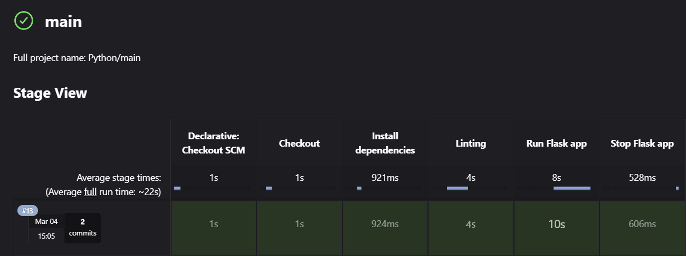

# flask-crud
A basic Python Flask application with the goal of learning Jenkins, Argo CD and Kubernetes.

## Jenkins Pipeline
I'm running Jenkins locally on my WSL2 Ubuntu Instance. The idea is to get some practice on how to set up Jenkins, configure Jenkins and make Pipelines for different tasks, like linting, testing, building or pushing images to a repository.

*Linting Check*

*Successful Pipeline Run*